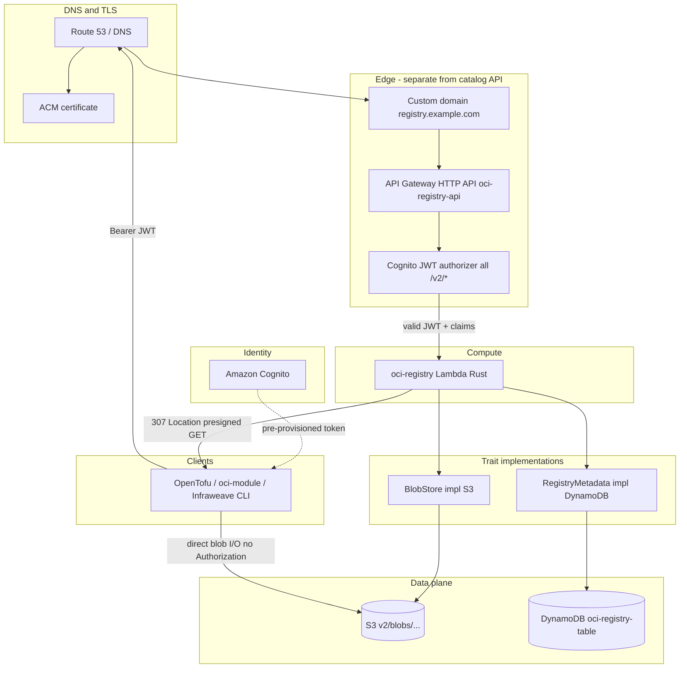
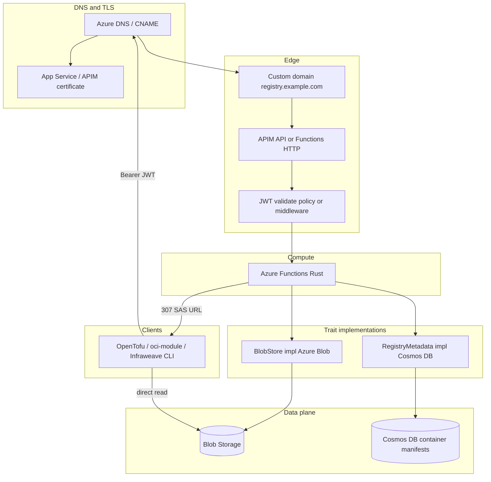

# Architecture — edge topology

Part of [oci-registry architecture](./architecture.md).

DNS, API Gateway/APIM, Lambda/Functions, and which traits sit behind compute. AWS and Azure share the same logical layout; only service names differ.

## AWS



| Component | Role |
|-----------|------|
| **DNS** (`registry.example.com`) | Points at API Gateway custom domain (or CloudFront → API GW). **Not** shared with `api.example.com` catalog host. |
| **ACM** | TLS for custom domain |
| **API Gateway HTTP API** | Second API in account; routes **`/v2/*`** only; avoids greedy `/{proxy+}` conflicts with catalog ([`registry_apigw_routing.md`](../registry/registry_apigw_routing.md)) |
| **JWT authorizer** | Cognito `issuer` + `audience`; validates `Authorization: Bearer` on every `/v2/*` route |
| **Lambda** | OCI handlers; repo **authZ** via `infraweave_oci::<repo>::r\|rw` claims; orchestrates traits |
| **`BlobStore` (S3)** | `head`, `put`, `presign_get`, `presign_put` (large upload offload) |
| **`RegistryMetadata` (DynamoDB)** | Single-table design: tags, digests, referrers GSI, upload sessions |

### Catalog vs OCI (same account, two APIs)

| | Catalog | OCI registry |
|---|---------|----------------|
| Host | `api.example.com` | `registry.example.com` |
| API | `catalog-api` | `oci-registry-api` |
| Paths | `/.well-known/terraform.json`, `/catalog/v1/*` | `/v2/*` |
| Lambda | tofu-* registries | `oci-registry` |

Registry **`Location`** headers (upload sessions) use forwarded `Host` + `X-Forwarded-Proto` (see [Registry public URL](#registry-public-url)). Blob **307** `Location` hosts are **S3** URLs, not the registry hostname.

## Dedicated hostname and separate API

The [OCI Distribution Spec v1.1.1](https://github.com/opencontainers/distribution-spec/blob/v1.1.1/spec.md#endpoints) defines every endpoint under **`/v2/` at the root of the registry URL** (`GET /v2/`, `GET /v2/{name}/blobs/{digest}`, …). Clients (`docker`, `oras`, OpenTofu `oci_credentials`) take a **registry hostname** and build paths from `/v2/` upward. The spec does **not** define an optional path prefix — there is no conformant `https://api.example.com/catalog/oci/v2/…` mount.

Infraweave’s **catalog** APIs use **context-path** segmentation on a shared host (`/.well-known/terraform.json`, `/catalog/v1/…`). OCI cannot be folded into that prefix without a strip-prefix reverse proxy (out of scope) and without breaking stock clients that expect `/v2/` on the registry host.

| Constraint | Consequence |
|------------|-------------|
| OCI rooted at `/v2/` | Serve the distribution API on a **dedicated registry hostname** (e.g. `https://registry.example.com/v2/…`) |
| Catalog on `/catalog/v1/` | Stays on `api.example.com` (or equivalent) with its own HTTP API |
| AWS HTTP API v2 routing | Routes match **method + path**, not `Host` inside one API — hostname separation = **custom domain (ApiMapping)** to a **separate** API, not a Host condition on routes |

**Default topology**: `registry.example.com` → **`oci-registry-api`** (routes **`/v2/*` only**); `api.example.com` → **`catalog-api`** (`/catalog/*`, `/.well-known/terraform.json`). Same AWS account, two HTTP APIs is normal. **Azure**: second APIM API or dedicated Functions custom domain with the same `/v2/*` map. **Lambda**: may reuse the same Rust binary; only API mapping / function app binding differs.

| Approach | Verdict |
|----------|---------|
| **Dedicated host + separate API GW** | **Required for production** — spec-correct `/v2/` surface, no route-order fights with catalog `/{proxy+}`, separate WAF/throttle/logs |
| Same API GW, both `/v2/*` and `/catalog/*` on one host | **Dev/local only** if this API has **no** foreign catch-all; still prefer a dedicated registry hostname for client config parity |
| OCI under `/catalog/…` or other prefix | **Not supported** — violates client + spec path expectations |
| “Route by `Host` header” inside one HTTP API | **Not** how AWS HTTP API v2 works — use a second API + ApiMapping per hostname |

Presigned blob **GET/PUT** `Location` hosts are object-store URLs; registry `Location` headers on upload sessions must use the **registry hostname** ([Registry public URL](#registry-public-url)).

## Compute — Lambda / Functions

Shared **`lib`** router for `oci-registry-local`, `oci-registry-aws` (Lambda), and `oci-registry-azure` (Functions). Edge validates JWT; compute runs repo authZ + trait orchestration only.

### Cold start

| Practice | Rationale |
|----------|-----------|
| **Thin entrypoint** | `src/bin/aws.rs` / `azure.rs` adapt API GW / Functions events → shared Axum router in `lib` — no heavy init in the adapter |
| **Reuse SDK clients** | `BlobStore` + `RegistryMetadata` (and underlying `aws_sdk_s3` / DynamoDB clients) behind `Arc`, initialized once per execution environment (`OnceLock` / process-global), not per request |
| **JWT at edge** | Invalid tokens never invoke Lambda/Functions ([`architecture-cost.md`](./architecture-cost.md#auth-cost-at-edge)) |

Provisioned concurrency is an **ops** knob (not required for MVP); code should still assume cold starts happen.

### Repository path (`{name}`)

OCI repository names may contain **slashes** as path-component separators (e.g. `acme/widgets`). The distribution spec defines `<name>` with a regex that includes `/` ([spec — name](https://github.com/opencontainers/distribution-spec/blob/v1.1.1/spec.md)); slashes in the name are **literal**, not a separate URL-encoding scheme for clients.

| Layer | Behavior |
|-------|----------|
| **Route** | `ANY /v2/{proxy+}` on API GW / SAM / Axum — capture everything after `/v2/` |
| **Parse** | Split suffix (`manifests/…`, `blobs/…`, `tags/list`, `referrers/…`, `blobs/uploads/…`) from the repository prefix; reconstructed `<name>` is the full string (e.g. `acme/widgets`) |
| **Validate** | Reject names that do not match the spec regex → **400** `NAME_INVALID` |
| **AuthZ** | Match **full** `<name>` to `infraweave_oci::<name>::r\|rw` ([`architecture-auth.md`](./architecture-auth.md)) — not the first path segment only |
| **Percent-encoding** | Apply normal path decoding for HTTP; do not treat encoded slashes in the name differently from the spec’s allowed `/` components |

Lambda and Functions share the same path parser as the local binary (`ANY /v2/{proxy+}` → spec-valid `<name>`).

## Registry public URL

Public registry URL for absolute **`Location`** headers (upload sessions, commit URLs) is derived at request time from the proxy event:

```text
{scheme}://{host}   where scheme = x-forwarded-proto (default https), host = headers.host
```

**Infra owns the hostname**: DNS → custom domain on API GW → clients send that `Host` → Lambda echoes it in registry `Location` responses. No separate product FQDN env var required in application code for deployed environments.

| Mechanism | Use |
|-----------|-----|
| **`Host` + `X-Forwarded-Proto`** | **Default** for Lambda behind API GW / APIM |
| `REGISTRY_PUBLIC_URL` env (optional) | Override when testing via `execute-api` URL or local binary without forwarded headers |
| Product FQDN / ACM | DNS + ApiMapping only — not duplicated in Rust |

Presigned blob **GET/PUT** `Location` hosts are **object-store** URLs (unchanged).

**Caveat**: Operators and CI must use the **same hostname clients use** (custom domain), not the raw `execute-api` endpoint, or `Location` URLs will point at the wrong host.

## Azure



| AWS | Azure |
|-----|-------|
| API Gateway HTTP API | Dedicated **APIM API** or **Functions** custom domain |
| Lambda | **Azure Functions** (HTTP trigger) |
| Cognito JWT authorizer | APIM **validate-jwt** policy or Functions middleware |
| S3 | **Azure Blob Storage** |
| DynamoDB | **Cosmos DB (NoSQL API)** |

Same client rules: pre-provisioned Bearer, no anonymous pull. Detail: [architecture-auth.md](./architecture-auth.md).
