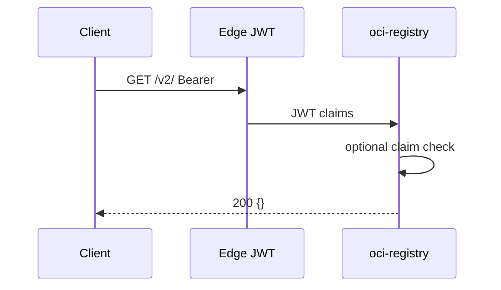
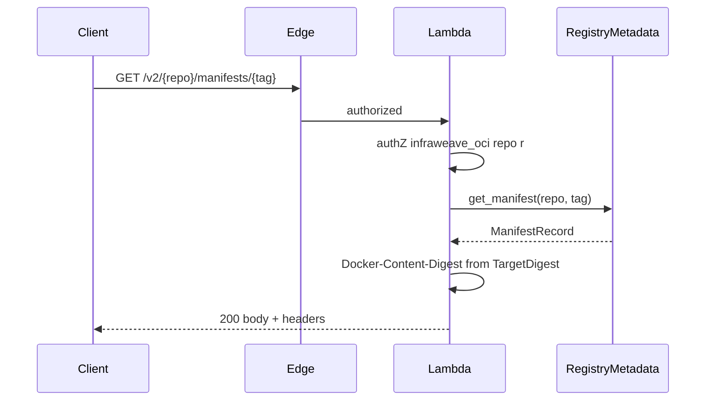
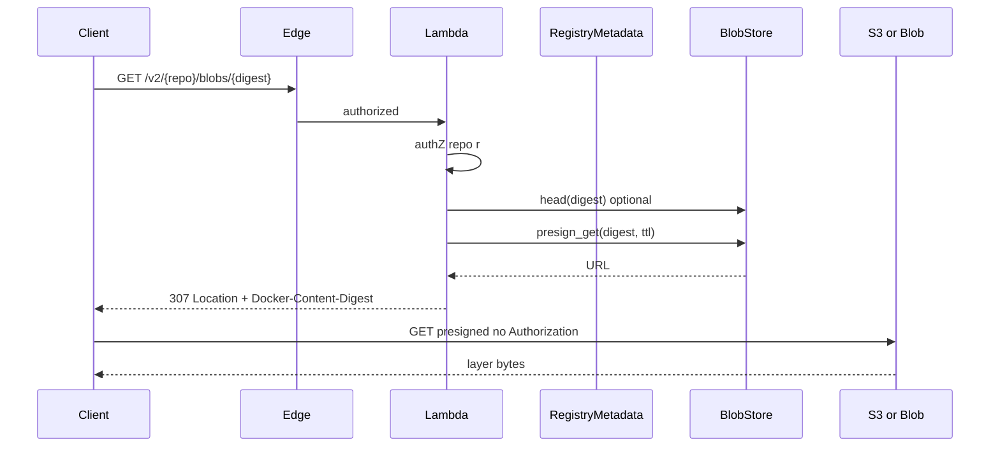
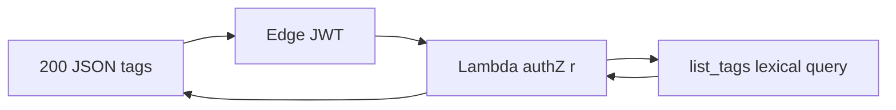
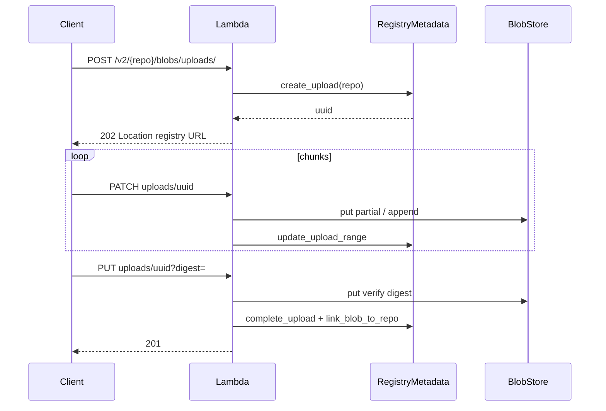
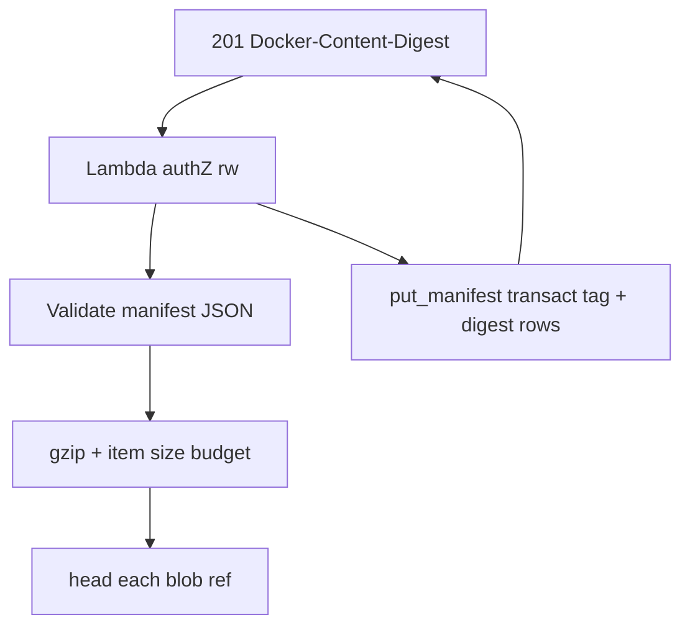
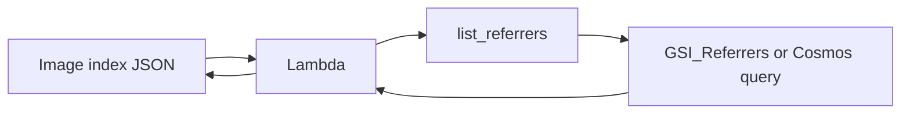
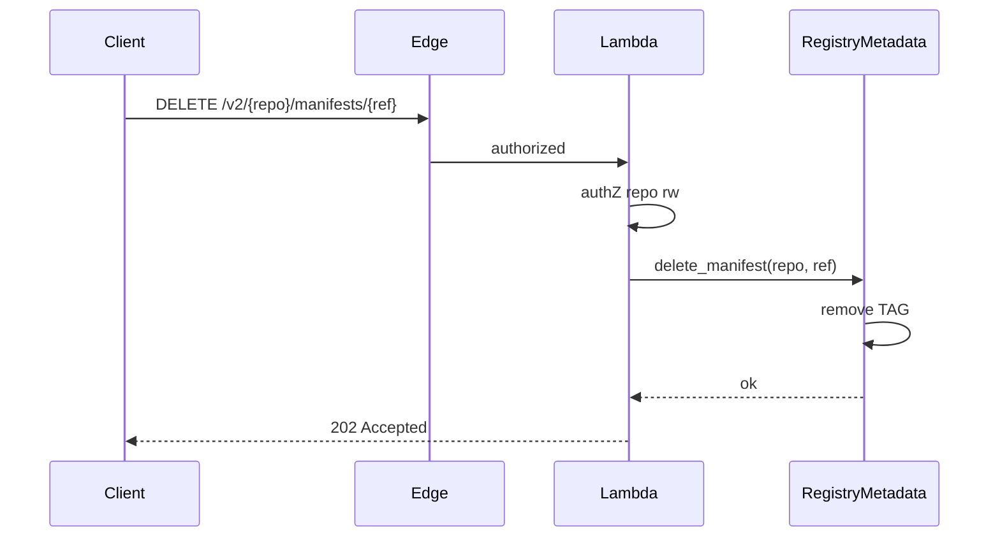
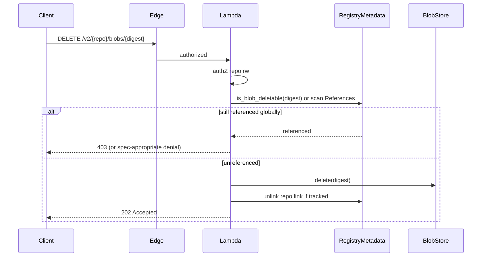

# Architecture — request flows

Part of [oci-registry architecture](./architecture.md).

Legend: **RM** = `RegistryMetadata`, **BS** = `BlobStore`, **Edge** = API GW/APIM JWT.

## Capability check

| Step | Trait |
|------|-------|
| AuthN | Edge only |
| Handler | No storage (or health) |

## Pull manifest by tag (tag “download”)

| Step | Trait | AWS | Azure |
|------|-------|-----|-------|
| Manifest read | **RM** | `GetItem` `TAG#{tag}` | `ReadItemAsync` `TAG-{tag}` |
| Blob list in manifest | — | Client parses JSON | Same |

**Spec note**: `Docker-Content-Digest` must be the hash of the **raw** manifest bytes, not the compressed store form ([architecture-backends.md](./architecture-backends.md)).

Tag usage logging: [observability](./architecture-observability.md).

## Pull manifest by digest

Same as tag pull but `get_manifest(repo, digest)` → **RM** `DIGEST#sha256:…` row.

## Pull blob (layer)

| Step | Trait |
|------|-------|
| Existence (optional) | **BS** `head` |
| Redirect | **BS** `presign_get` |
| Bytes | Client → object store |

`GET /v2/{name}/blobs/{digest}` returns **307 Temporary Redirect** with `Location` set to a time-limited object-store URL (S3 presigned GET, Azure Blob SAS). The distribution spec allows this pattern (same as Docker Hub / GHCR); it keeps multi-GB layers off Lambda and API Gateway ([cost rationale](./architecture-cost.md#blob-path-deduplication-and-lambda-limits)).

**Requirements**: Always set `Docker-Content-Digest` on the **307** response. Presign TTL must exceed slow pulls (typically **15–60+ minutes**; align with catalog presign policy in [`../registry/registry_decisions.md`](../registry/registry_decisions.md)). Clients must not forward `Authorization` to the object-store URL.

**Expired presign**: Not a registry session problem. If the object store rejects a stale URL (**403** / **400**) before the download finishes, the client repeats `GET …/blobs/{digest}` on the registry and follows the new **307** — no special server state.

`HEAD` blob may return **200** from registry without redirect (cheaper); document the chosen behavior in tests.

## List tags

| Trait | Operation |
|-------|-----------|
| **RM** | Query partition `REPO#…`, `SK` begins_with `TAG#`, ordered |

## Push blob

Upload supports two byte paths: **registry-hosted** (default) and **presigned offload** (for large blobs).

| Mode | Push behavior |
|------|----------------|
| **Registry-hosted** | `POST` **202** with registry-hosted upload URL; `PATCH`/`PUT` write through `BlobStore` SDK from compute (no redirect). |
| **Presigned offload** | `POST` **202** `Location` may be presigned **PUT** to S3/Blob; **terminal commit** `PUT ?digest=` stays on **registry host** (or object-store notification + registry finalize) so digest validation and `201` + `Location` remain registry-controlled. |

The distribution spec allows offloaded upload `Location`, but object stores do not implement OCI upload completion responses. Monolithic completion `Location` on **201** may point at a presigned pull URL ([spec: signed URL example](https://github.com/opencontainers/distribution-spec/blob/v1.1.1/spec.md#single-post)). Registry **`Location`** on upload sessions use the registry hostname; presigned blob URLs use the object-store host ([`architecture-edge.md`](./architecture-edge.md#registry-public-url)).

### Registry-hosted upload

| Layer | Trait | Notes |
|-------|-------|-------|
| Session | **RM** | Upload row under repo partition |
| Bytes | **BS** | SDK from compute; no upload redirect on registry-hosted path |
| Commit | **RM** + **BS** | Digest verified; enter global pool |

### Chunked upload

Behavior follows [distribution spec — pushing content](https://github.com/opencontainers/distribution-spec/blob/v1.1.1/spec.md#pushing-content) (session `POST`/`PATCH`/`PUT`, monolithic `POST ?digest=`, range validation).

| Case | Behavior |
|------|----------|
| `PATCH` with wrong `Content-Range` | **416 Requested Range Not Satisfiable** (spec: out-of-order chunk) |
| `OCI-Chunk-Min-Length` on **202** | Echo when applicable; reject PATCH smaller than min **except** final chunk → **416** |
| Last bytes | Client may use final `PATCH` or `PUT` with body; session **must** complete with `PUT …/uploads/{uuid}?digest=` → **201** |
| **Registry-hosted** byte path | `PATCH`/`PUT` through compute → `BlobStore::put` / append; stay under API GW ~10 MB request cap ([`architecture-cost.md`](./architecture-cost.md#blob-path-deduplication-and-lambda-limits)) — buffer in compute only under configured cap |
| **Presigned offload** byte path | Large uploads: `POST` **202** `Location` may be presigned object-store **PUT**; remaining `PATCH` ranges may map to S3 multipart parts (no full-object buffer in compute) |

Monolithic `POST …/uploads/?digest=` with body: if over API GW limit, return **202** + session (spec: registries MAY fall back to POST+PATCH/PUT).

### Presigned upload offload

After `POST` **202**, the client may `PUT` bytes directly to a presigned object-store URL (`BlobStore::presign_put`). It **must** still call **terminal commit** `PUT /v2/…/uploads/{uuid}?digest=` on the **registry host** so the registry verifies digest/size and returns OCI **201** + `Location` (object stores do not implement OCI upload completion). Lambda timeout and payload limits motivate the offload ([`architecture-cost.md`](./architecture-cost.md#blob-path-deduplication-and-lambda-limits)).

| Case | Behavior |
|------|----------|
| Presigned `Location` on **202** | Client `PUT`s to S3/Blob; then registry **commit** `PUT ?digest=` on registry hostname |
| Presigned PUT without `Content-Length` | Reject at presign generation if client declared length on initiating `POST` |
| Threshold | Optional `PRESIGN_UPLOAD_MIN_BYTES` — use presigned offload only above configured size |

Presigned `Location` on **202** must not allow open-ended PUT when the client declared `Content-Length` on the initiating `POST` (reject at presign generation). Terminal commit always runs on the registry hostname.

## Push manifest + tag

| Trait | Work |
|-------|------|
| **BS** | `head` on referenced layer digests |
| Handler | Gzip raw JSON once; reject if gzip `ManifestPayload` exceeds per-row budget ([`architecture-backends.md#manifest-payload-size-limit`](./architecture-backends.md#manifest-payload-size-limit)) |
| **RM** | Atomic write: `TAG#` + `DIGEST#` (+ referrer `SubjectDigest` if attestation) |

## Referrers (OCI v1.1)

Infraweave implements **`GET /v2/{name}/referrers/{digest}`**. When the referrers API is supported, the distribution spec requires the registry **not** to return **404** for referrers requests ([Listing Referrers](https://github.com/opencontainers/distribution-spec/blob/v1.1.1/spec.md#listing-referrers)).

| Cloud | **RM** implementation |
|-------|------------------------|
| AWS | DynamoDB **GSI_Referrers**: `SubjectDigest` + `PK` |
| Azure | Query/filter on `subjectDigest` within repo partition or dedicated index |

| Step | Behavior |
|------|----------|
| Push manifest with `subject` | `put_manifest` sets `SubjectDigest` on `DIGEST#` row → GSI row for referrers query |
| `GET …/referrers/{digest}` | `list_referrers`; optional `?artifactType=` filter → **200** image index; empty set → empty index, not **404** |
| `artifactType` on descriptors | From manifest `artifactType`, or config `mediaType` if missing (per spec) |

### Referrers tag schema (spec fallback — not server-maintained)

If a registry lacks the referrers API, clients maintain a synthetic **tag** (referrers tag schema) via read/modify/write. The spec assigns **race conditions and data loss on that tag to clients**, not the registry ([Referrers Tag Schema](https://github.com/opencontainers/distribution-spec/blob/v1.1.1/spec.md#referrers-tag-schema)); resolution is to use a registry with the referrers API (this design).

| Role | Responsibility |
|------|----------------|
| **oci-registry** | Index `subject` at push; serve `GET …/referrers/{digest}` from metadata — **no** server-side maintenance of referrers tag schema |
| **Clients** | Prefer referrers API; if they receive **404** on referrers API only, may fall back to tag schema (their concurrency problem) |
| **Enable API on existing repo** | Per [Enabling the Referrers API](https://github.com/opencontainers/distribution-spec/blob/v1.1.1/spec.md#enabling-the-referrers-api): **MUST** include manifests already listed in a valid referrers tag-schema index; **MUST** include newly pushed manifests with `subject` |

Optional `?artifactType=` filter returns **200** image index; empty set → empty index, not **404**.

## Blob mount

Cross-repository mount: `POST /v2/{name}/blobs/uploads/?mount={digest}&from={source_repo}`. `{name}` is the destination repo; `from` is the source repo. Blobs live in a **global** `BlobStore`; mount only adds a repo link in metadata ([`architecture-cost.md`](./architecture-cost.md#blob-path-deduplication-and-lambda-limits)).

| Step | Trait / layer |
|------|----------------|
| AuthZ | `infraweave_oci::<from>::r` and `infraweave_oci::<{name}>::rw` ([`architecture-auth.md`](./architecture-auth.md)) |
| Existence | **BS** `head(digest)` — digest must already be in the global pool (present in `from` or any repo) |
| Link | **RM** `link_blob_to_repo(name, digest)` — no second S3/Blob copy |

| Response | When |
|----------|------|
| **201** | `head` succeeds; `link_blob_to_repo` done; `Location` + `Docker-Content-Digest` |
| **404** | Digest not in blob pool (including wrong/missing source) — **do not** fall back to **202** upload session ([spec allows **202**](https://github.com/opencontainers/distribution-spec/blob/v1.1.1/spec.md#mounting-a-blob-from-another-repository); Infraweave fails fast) |
| **403** | Missing `r` on `from` or `rw` on destination |

## DELETE manifest (end-9)

Spec: [Delete Manifest](https://github.com/opencontainers/distribution-spec/blob/v1.1.1/spec.md#delete-manifest). Requires `infraweave_oci::<repo>::rw` ([`architecture-auth.md`](./architecture-auth.md)). Until implemented, handlers may return **405**; conformance runs with `OCI_TEST_CONTENT_MANAGEMENT=0` ([`guidelines-conformance.md`](./guidelines-conformance.md)).

| Step | Trait / layer | Notes |
|------|---------------|-------|
| AuthZ | Handler | `::rw` on `{name}` |
| Resolve `ref` | **RM** | Tag name → `TAG#` row; digest string → `DIGEST#` row |
| Delete | **RM** | Remove tag row; remove or update digest row per spec |
| Referrers | **RM** | If deleted manifest was a referrer (`SubjectDigest` on its `DIGEST#` row), remove GSI/index entries; if deleted manifest was a **subject**, referrers listing for that digest shrinks (no orphan GSI rows) |
| Blob bytes | — | **Do not** delete layer blobs on manifest delete — blobs stay in global `BlobStore` until unreferenced and GC runs ([`architecture-operations.md`](./architecture-operations.md)) |

| Response | When |
|----------|------|
| **202** Accepted | Manifest removed from namespace (spec-accurate status) |
| **404** `MANIFEST_UNKNOWN` | Tag or digest not found |
| **403** | Missing `::rw` claim |
| **405** | DELETE not implemented (acceptable before content-management slice) |

Delete by **tag** removes the `TAG#` row; the `DIGEST#` row remains if other tags or digest pulls still reference the same manifest. Delete by **digest** removes the `DIGEST#` row (and associated `References` / `SubjectDigest` fields); remove `TAG#` rows that pointed at that digest. Use atomic writes (DynamoDB transact / Cosmos batch) when tag and digest rows must stay consistent.

## DELETE blob (end-10)

Spec: [Delete Blob](https://github.com/opencontainers/distribution-spec/blob/v1.1.1/spec.md#delete-blob). Blobs live in a **global** `BlobStore`; repo namespace is metadata only ([`architecture-cost.md`](./architecture-cost.md#blob-path-deduplication-and-lambda-limits)).

| Step | Trait / layer | Notes |
|------|---------------|-------|
| AuthZ | Handler | `::rw` on `{name}` |
| Refcheck | **RM** | Scan `References` on all `DIGEST#` rows **across repos**, or maintain refcount — digest must have **zero** manifest references globally |
| Delete bytes | **BS** | `BlobStore::delete` only after refcheck passes ([`architecture-traits.md`](./architecture-traits.md) — GC-only delete) |
| Repo link | **RM** | Optional `link_blob_to_repo` cleanup for the requesting repo |

| Response | When |
|----------|------|
| **202** Accepted | Digest unreferenced globally; object removed from object store |
| **403** | Digest still referenced by any manifest in any repo |
| **404** `BLOB_UNKNOWN` | Digest not in blob pool |
| **403** | Missing `::rw` claim |

**Global pool rule**: Two repos sharing a layer digest (mount or dedupe) share one S3/Blob object. DELETE from repo A must **not** remove bytes while repo B’s manifest still lists that digest. `link_blob_to_repo` edges alone do not justify delete — only absence from all manifest `References` graphs.

Background GC ([`architecture-operations.md`](./architecture-operations.md)) uses the same refcheck before `BlobStore::delete`; the DELETE API is the operator-facing path for explicit blob removal when safe.

## Endpoint → trait matrix

| Endpoint | RM | BS | Edge |
|----------|:--:|:--:|:----:|
| `GET /v2/` | | | ✓ |
| `GET/HEAD …/blobs/{digest}` | | ✓ | ✓ |
| `GET/HEAD …/manifests/{ref}` | ✓ | | ✓ |
| `GET …/tags/list` | ✓ | | ✓ |
| `GET …/referrers/{digest}` | ✓ | | ✓ |
| `POST/PATCH/PUT …/uploads/` | ✓ | ✓ | ✓ |
| `PUT …/manifests/{ref}` | ✓ | ✓ (head refs) | ✓ |
| `DELETE` manifest/blob | ✓ | ✓ | ✓ |
