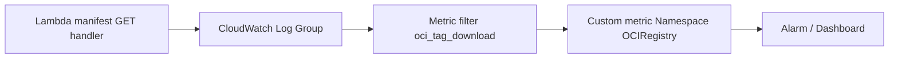

# Architecture — observability

Part of [oci-registry architecture](./architecture.md).

Structured logs and operational metrics for the OCI registry: tag usage, error rates, presign failures, and GC. GC runbook context: [architecture-operations.md](./architecture-operations.md).

**Do not log**: manifest bodies, JWTs, or presigned URLs (GET or PUT).

---

## Tag download (usage telemetry)

Emit on successful tag manifest GET alongside the handler in [architecture-flows.md](./architecture-flows.md#pull-manifest-by-tag-tag-download).

### Requirement

When a client resolves a **tag** to a manifest (`GET /v2/{name}/manifests/{tag}`), the handler emits a **structured log line** so operators can measure tag usage without a separate analytics DB.

### What to log

Log on **successful** manifest GET when `reference` is a **tag** (not when `reference` is already a digest — optional separate event `oci_manifest_download` if desired).

| Field | Example | Purpose |
|-------|---------|---------|
| `event` | `oci_tag_download` | Metric filter / KQL discriminator |
| `repository` | `acme/widgets` | Repo dimension |
| `tag` | `v1.0.0` | Tag dimension |
| `digest` | `sha256:abc…` | Resolved `TargetDigest` |
| `media_type` | `application/vnd.oci.image.manifest.v1+json` | Artifact type |
| `subject` | Cognito `sub` or client id | Who pulled (from JWT claims) |
| `request_id` | API GW request id | Trace correlation |

**Example (JSON, one line)**

```json
{
  "event": "oci_tag_download",
  "repository": "acme/widgets",
  "tag": "v1.0.0",
  "digest": "sha256:abc123...",
  "media_type": "application/vnd.oci.image.manifest.v1+json",
  "subject": "a1b2c3d4-...",
  "request_id": "abc-123"
}
```

Use `tracing`/`log` at **info** level in Rust; ensure Lambda JSON log format (no multiline).

### AWS — tag download metrics



1. **Lambda** logs JSON to the function’s log group (default).
2. Create a **metric filter** on that log group:
   - **Filter pattern** (space-delimited for JSON logs):  
     `{ $.event = "oci_tag_download" }`
   - **Metric name**: `TagDownload`
   - **Namespace**: `OCIRegistry`
   - **Metric value**: `1`
   - **Default value**: 0
3. Optional **dimensions** (CloudWatch Logs metric filter limits: embed in metric name or use **EMF** if you need rich dimensions):
   - Simple: one metric `TagDownload` + filter per repo/tag via separate filters (does not scale).
   - Better: emit **[Embedded Metric Format](https://docs.aws.amazon.com/AmazonCloudWatch/latest/monitoring/CloudWatch_Embedded_Metric_Format.html)** from Lambda with `Repository` and `Tag` dimensions.
4. **Dashboards / alarms**: Sum `TagDownload` over 5m; alarm on anomaly or quota.
5. **Logs Insights** ad hoc:

```sql
fields @timestamp, repository, tag, digest, subject
| filter event = "oci_tag_download"
| stats count() by repository, tag
```

**API Gateway access logs** are insufficient alone: they lack resolved digest and conflate tag vs digest references unless you parse paths; prefer **application** logs from Lambda.

### Azure — tag download metrics

Azure Functions typically ships logs to **Application Insights** (workspace-backed **Log Analytics**).

### Option A — structured trace (recommended with Rust `tracing`)

Log the same JSON fields as above. In Log Analytics, table is usually `traces` (or `AppTraces`).

```kusto
traces
| where customDimensions.event == "oci_tag_download"
    or message has "oci_tag_download"
| extend repo = tostring(customDimensions.repository)
       , tag = tostring(customDimensions.tag)
| summarize PullCount = count() by repo, tag, bin(timestamp, 1h)
```

Create an **alert rule** on that query (e.g. count &gt; threshold per hour) or pin to a workbook.

### Option B — custom metrics via Application Insights

If using the App Insights ingestion API, map fields to `customMeasurements` for native metrics charts. Rust services often rely on **OpenTelemetry** exporter → App Insights; same `event` attribute.

### Option C — metric alert on trace volume

Simpler but coarser: alert when `traces | where message contains "oci_tag_download"` exceeds N in 5 minutes.

| AWS | Azure |
|-----|-------|
| CloudWatch metric filter on JSON `event` | KQL on `traces` / `AppTraces` |
| Custom namespace `OCIRegistry` | Log Analytics workbook or metric alert |
| EMF for dimensions | OpenTelemetry attributes → `customDimensions` |

### Tag download implementation hook

```rust
// After successful RM::get_manifest for a tag reference:
tracing::info!(
    event = "oci_tag_download",
    repository = %repo,
    tag = %tag,
    digest = %record.digest,
    media_type = %record.media_type,
    subject = %jwt_sub,
    request_id = %request_id,
);
```

Digest-only GETs can use `event = "oci_manifest_download"` if product wants parity without polluting tag metrics.

---

## Operational health metrics

Beyond tag usage: error rates, presign failures, and GC outcomes for SLO dashboards and alarms. Emit from handlers and background workers via the same `tracing` JSON pipeline.

### Error rate (4xx / 5xx)

On OCI error responses (or uncaught handler failures mapped to **5xx**), emit a structured line or **Embedded Metric Format (EMF)** counter:

| Field | Example | Purpose |
|-------|---------|---------|
| `event` | `oci_registry_error` | Filter discriminator |
| `status` | `404` | HTTP status |
| `error_code` | `BLOB_UNKNOWN` | OCI error code when present |
| `method` | `GET` | HTTP method |
| `route` | `blobs` | Coarse route bucket — not full path with repo names in high-cardinality alarms |
| `request_id` | API GW id | Trace correlation |

**Metrics**: increment `oci_registry_4xx` for 4xx, `oci_registry_5xx` for 5xx (namespace `OCIRegistry` on AWS). Prefer EMF or metric filters on `event = "oci_registry_error"` with `status` dimension bucketing.

**Alarms**:

- **5xx rate** spike over 5m → page on-call (registry unavailable or storage backend failure).
- **4xx rate** anomaly optional (often client misconfiguration; tune threshold to avoid noise).

### Presign failures

When `BlobStore::presign_get` or `presign_put` returns an error before a **307** or upload **202** `Location` is sent:

| Field | Example |
|-------|---------|
| `event` | `oci_presign_failure` |
| `operation` | `presign_get` \| `presign_put` |
| `digest` | `sha256:…` |
| `error` | SDK error summary (no URL, no credentials) |

Log at **warn** or **error**. Metric: `PresignFailure` count in `OCIRegistry` namespace. Alarm when presign failures exceed baseline — often indicates IAM, bucket policy, or clock skew.

### GC metrics

When the GC job runs ([`architecture-operations.md`](./architecture-operations.md)):

| Field | Example |
|-------|---------|
| `event` | `oci_gc_run` \| `oci_gc_dry_run` |
| `candidates` | `42` |
| `deleted` | `40` |
| `skipped` | `2` |
| `errors` | `0` |

Alarm on `errors > 0` or unexpected `deleted` spike after deploy.

---

## Dashboards and alarms (summary)

| Signal | Source event / metric | Suggested alarm |
|--------|----------------------|-----------------|
| Tag pulls | `oci_tag_download` / `TagDownload` | Anomaly or quota (optional) |
| Client/server errors | `oci_registry_error` / 4xx, 5xx | 5xx rate &gt; threshold |
| Presign / SAS failures | `oci_presign_failure` / `PresignFailure` | Count &gt; 0 sustained 5m |
| GC health | `oci_gc_run` / `oci_gc_dry_run` | `errors &gt; 0` on live run |

**AWS**: CloudWatch dashboard combining `OCIRegistry` custom metrics + Logs Insights for drill-down. **Azure**: Log Analytics workbook or metric alerts on `traces` with matching `event` fields.

Validate metric filter / KQL patterns in unit tests (log line fixture → expected filter match) before wiring production alarms.

---

## Privacy and retention

- Logs contain **repo/tag/digest/sub** — treat as operational telemetry, not PII-heavy, but restrict log IAM.
- **Retention**: align with compliance (e.g. 30–90 days).
- **Cost**: INFO logs on high pull volume are cheaper than DynamoDB analytics; sample only if volume is extreme (document sampling policy).
