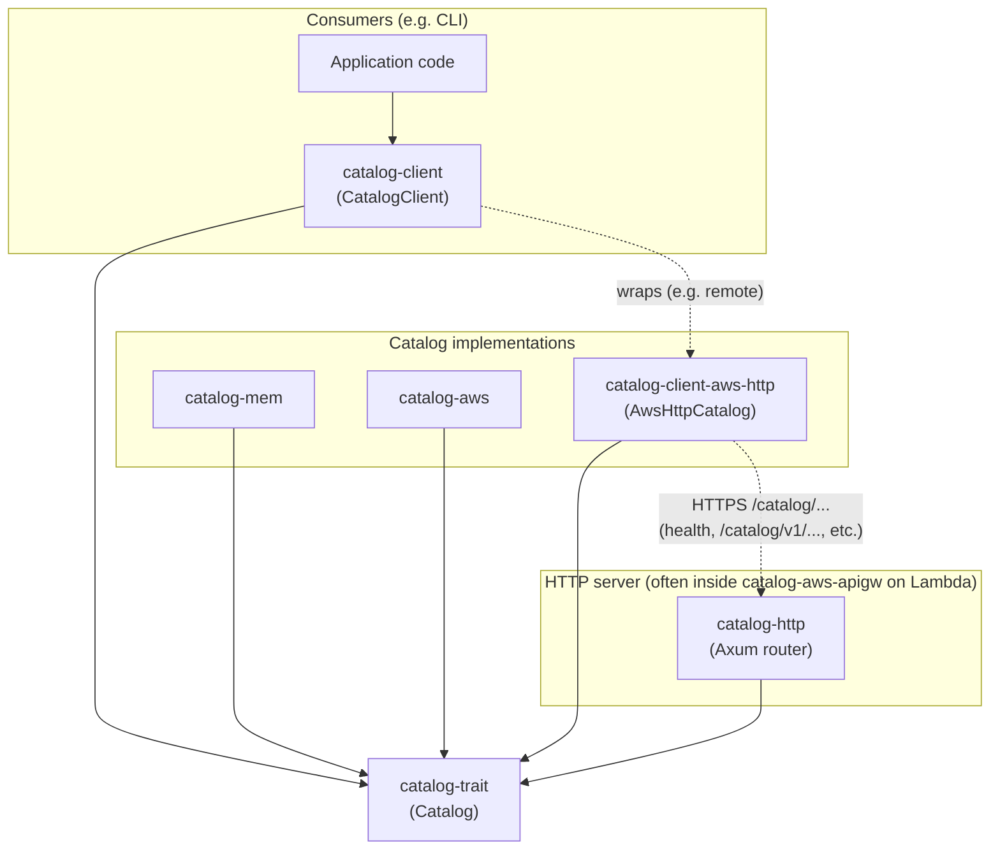
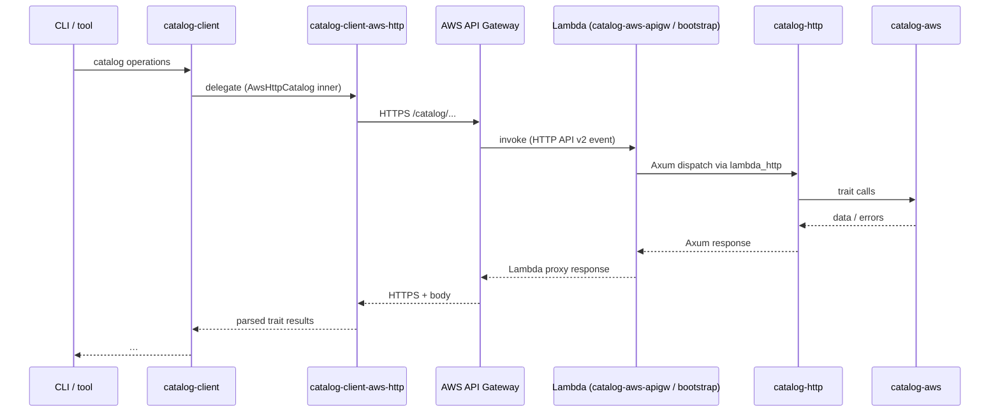
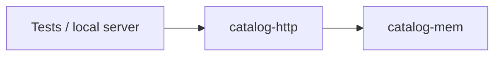
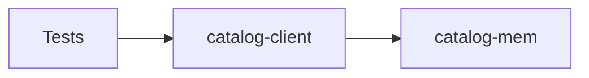

# Catalog workspace

Rust crates under **`catalog/`** for the **catalog** domain: a shared [`catalog-trait`](catalog-trait) contract, HTTP and AWS surfaces, in-memory test doubles, and client helpers used by tools (for example a CLI). These crates are workspace members of the repo root [`Cargo.toml`](../Cargo.toml) (`catalog/catalog-*`).

Trait-level API (read/management types and methods) is documented in [`catalog-trait/README.md`](catalog-trait/README.md). The AWS backend has operator-oriented notes in [`catalog-aws/docs/`](catalog-aws/docs/).

## Crates at a glance

| Crate | Role |
|--------|------|
| [`catalog-trait`](catalog-trait) | `Catalog` / read / management traits and shared types. Everything else depends on this. |
| [`catalog-aws`](catalog-aws) | Production backend: DynamoDB + S3 (implements the trait). |
| [`catalog-mem`](catalog-mem) | In-process store for tests and local dev (implements the trait). |
| [`catalog-http`](catalog-http) | Axum router exposing the catalog as JSON/REST (`/catalog/health`, `/catalog/v1/...`). **Does not** pick a backend—it is wired with any `Catalog` implementation. |
| [`catalog-client-aws-http`](catalog-client-aws-http) | Remote `Catalog` over HTTP: speaks the same REST contract as `catalog-http` (works behind API Gateway). |
| [`catalog-client`](catalog-client) | Caller-side helpers: [`CatalogClient`](catalog-client/src/client.rs) wraps any `Catalog` and normalizes `download_*` [`ContentSource`](catalog-trait/src/read.rs) to in-memory bytes; [`materialize_content`](catalog-client/src/content.rs) resolves URL/path sources to owned bytes. |
| [`catalog-aws-apigw`](catalog-aws-apigw) | Lambda-oriented crate that hosts `catalog-http` and selects **`catalog-aws`** or **`catalog-mem`** via Cargo features (`aws` default, `mem` for tests). Ships the **`bootstrap`** binary expected by API Gateway + Lambda deployments. See [`catalog-aws-apigw/README.md`](catalog-aws-apigw/README.md). |

## Conceptual layering



- **Trait boundary**: `catalog-trait` is the only shared API between “callers” and “backends.”
- **`catalog-client`** sits on the **caller** side: it wraps whatever implements the trait (in-memory, HTTP client, etc.).
- **`catalog-http`** sits on the **server** side: it adapts HTTP to the same trait.

## Production-style wiring (remote catalog)

In deployment, HTTP clients do not talk to `catalog-aws` directly. Traffic goes through API Gateway to a Lambda (or other host) that runs **`catalog-http`** backed by **`catalog-aws`**.



`catalog-aws-apigw` is the usual place this is assembled: it depends on `catalog-http` and, with the default **`aws`** feature, on `catalog-aws` for persistence. Build with **`--no-default-features --features mem`** when you want the same Lambda shape without the AWS SDK (see the crate README).

## Local / test wiring

For tests you want **deterministic, fast** behavior without AWS. Two common patterns:

### A. Full HTTP stack, in-memory backend

Run **`catalog-http`** with **`catalog-mem`** as the trait implementation (same routes and serialization as production; no network to AWS). The `catalog-aws-apigw` crate can be built with the **`mem`** feature for a Lambda-shaped host that uses `catalog-mem` instead of `catalog-aws`.



### B. No HTTP: trait directly in-process

Point **`catalog-client`** (and your code under test) at **`catalog-mem`** directly. No `catalog-http`, no API Gateway—ideal for unit tests and fast integration tests that only need the catalog contract.



`catalog-client-aws-http`’s own tests use this style: they spin up `catalog-http` over `catalog-mem` with Axum/tower to exercise the HTTP client against a real router.

## Choosing a path

| Goal | Catalog implementation | Notes |
|------|------------------------|--------|
| Production remote access | `catalog-client-aws-http` → gateway URL | Matches deployed REST contract. |
| Production service | `catalog-http` + `catalog-aws` | Often via `catalog-aws-apigw` (`bootstrap`) behind API Gateway. |
| HTTP contract tests | `catalog-http` + `catalog-mem` | Same paths and payloads as prod, no AWS. |
| Fast in-process tests | `catalog-mem` only | Use with or without `catalog-client` helpers. |

## Build and test (from repo root)

```bash
cargo test -p catalog-trait
cargo test -p catalog-http
cargo test -p catalog-client-aws-http
# Lambda crate: library tests without AWS SDK
cargo test -p catalog-aws-apigw --no-default-features
# Default features include AWS roundtrips where applicable
cargo test -p catalog-aws-apigw
```

All of these paths converge on **`catalog-trait`**: keep new backends and clients aligned with that API so tools can swap implementations without changing their core logic.
